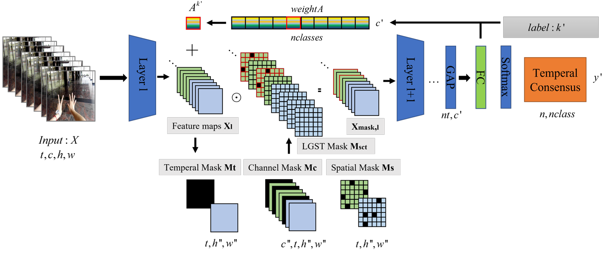
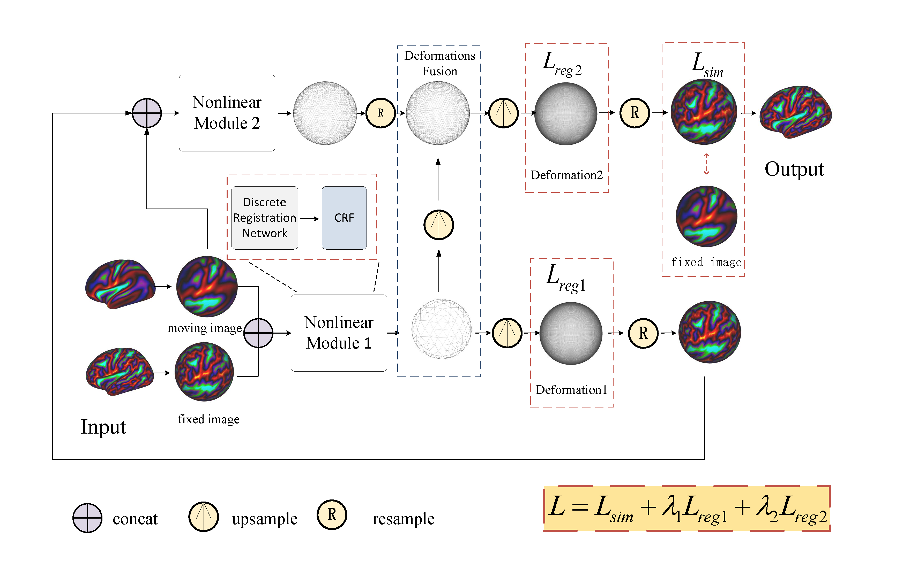
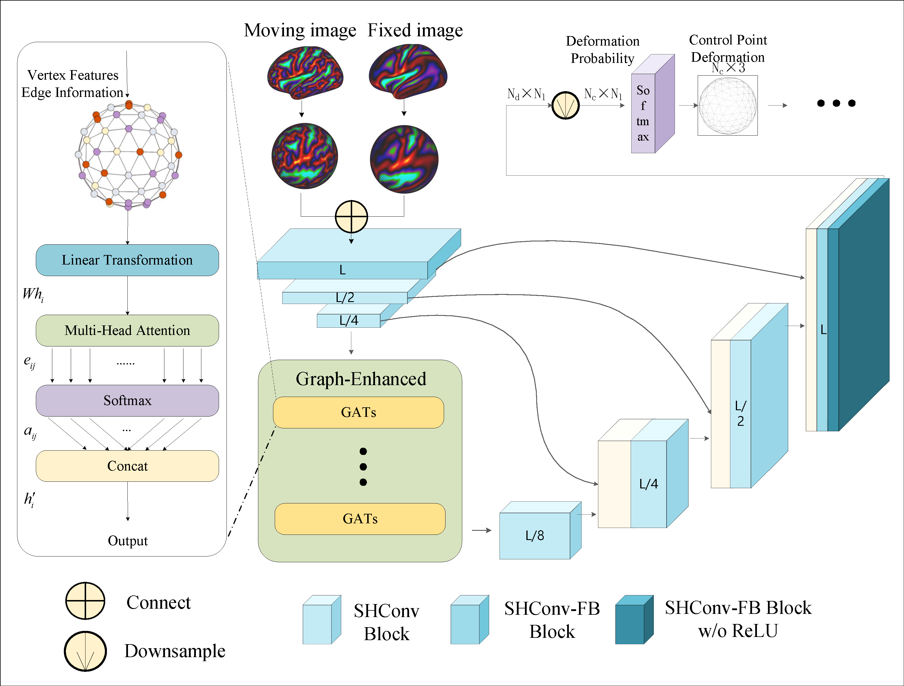
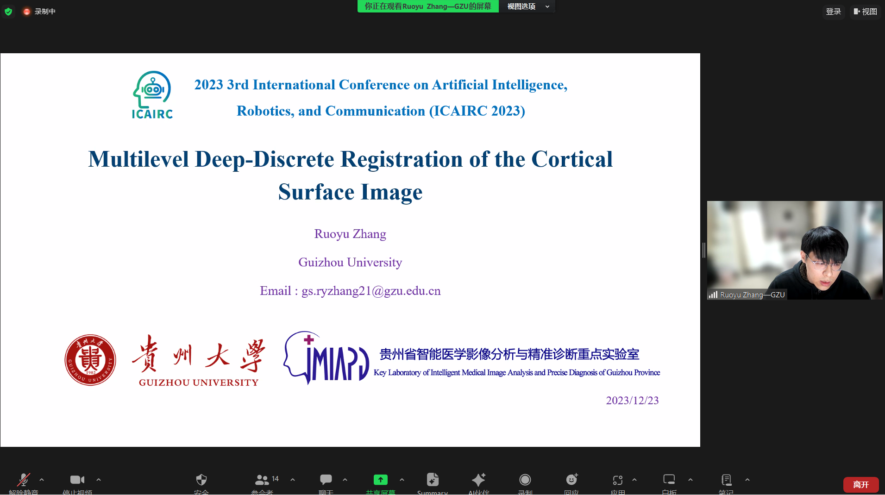

I am Ruoyu Zhang, and I have obtained my Master's degree in Software Engineering from Guizhou University. I am currently applying for PhD programs for the Fall 2025 intake. Below is an overview of my background: 

EDUCATION
------
Guizhou University	Guizhou, China

Supervisor: Prof. [Lihui Wang](https://example.com) Sep 2021 – July 2024

__Master in Software Engineering__       

( Ranked 10th in Software Engineering in China (Top 7%, 2024 ShanghaiRanking) 
[ShanghaiRanking 2024 - Software Engineering](https://www.shanghairanking.cn/rankings/bcsr/2024/0835) )

GPA: 3.24/4 (Ranked 1st out of 44 students in comprehensive evaluation)

Shandong University of Science and Technology	Qingdao, China

__B.S. in Computer Science__ Sep 2016 – July 2020

Average Score: 82.02/100

PESEARCH INTERESTS
------
Machine Learning, Computer Vision and Pattern Recognition, MR/AR/VR, Human-Computer Interaction, Educational Technology

PUBLICATIONS
------
[Journal of Electronic Imaging]

LGST-Drop: Label-guided structural dropout for spatial–temporal convolutional neural networks
Cui H., Huang R., __Zhang R__., et al. 
Journal of Electronic Imaging, IF: 31(3): 033036-033036, 2022

Brief Description: This work utilizes deep learning methods for action recognition and improves the performance of convolutional neural networks through a novel dropout method.

PREPRINTS
------
GESH-Net: Graph-Enhanced Spherical Harmonic Convolutional Networks for Cortical Surface Registration
__Ruoyu Zhang__, Lihui Wang, Kun Tang, Jingwen Xu, Hongjiang Wei, Arxiv Preprint

  <!-- 左边的图片 -->
  

    
    
  

  <!-- 右边的图片 -->
  

    
  

Brief Description: This work is dedicated to the study of deep learning methods on non-Euclidean shapes. By applying convolutional neural networks and graph attention on spherical surfaces, it enhances the performance of cortical surface image registration.

RESEARCH EXPERIENCE  
------
• __Cortical Surface Image Registration Research__

Intelligent Medical Image Analysis and Precision Diagnosis Lab, Guizhou University	 Guizhou, China Oct 2022 – Jun 2024

Research assistant, supervised by Prof. Lihui Wang

- Processed large-scale cortical surface data and developed a deep learning model for cortical surface registration, improving alignment and analysis accuracy.
  
- Conducted research on spherical convolutional neural networks (Spherical CNNs), focusing on applying them to cortical surface data for advanced spatial analysis.
  
•	__Perception and Tracking Algorithms for AR Devices__

Artificial Intelligence Lab, Guizhou University	 Guizhou, China Aug 2021 – Oct 2022

Research assistant, supervised by Prof. Chuhua Huang

- Developed and implemented SLAM (Simultaneous Localization and Mapping) technology for AR devices and smartphones, enhancing real-time spatial awareness and interaction.
  
- Collaborated on the development of a deep learning model for action recognition, optimizing accuracy and performance for real-world applications.

SELECTED AWARDS AND HONORS
------
•	Special Academic Scholarship (Top 3%), Guizhou University	2024

•	National First Prize, 18th "Challenge Cup" National College Students' Extracurricular Academic Science and Technology Competition	2023

•	First-class Graduate Academic Scholarship (Top 5%), Guizhou University	2022

•	National Third Prize, Robocom Robotics Developer Competition - Second-class Scholarship (Top 20%), Shandong University of Science and Technology 2022

•	Second-class Scholarship (Top 20%), Shandong University of Science and Technology	2017 & 2018

INVITED TALKS AND MEDIA COVERAGE
------
•	Invited talk for the 2023 3rd International Conference on Artificial Intelligence, Robotics, and Communication (ICAIRC 2023), Xiamen, China, December 23, 2023.

SKILLS
------
Progarmming: C, Python(Pytorch, Tensorflow, PyG), LATEX, MATLAB, Development and debugging on Linux servers

English: IELTS in prepared. I expect to achieve a score of 6.5 or higher in early November.
